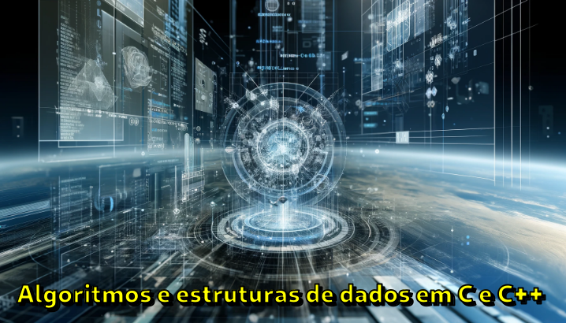

[**Cleuton Sampaio**](https://linkedin.in/cleutonsampaio)

Um dos grandes desafios em algoritmos é a construção de interpretadores e compiladores. E, dentro desse desafio, analisar expressões é sempre vista como uma tarefa complexa. 

Felizmente, temos algoritmos clássicos para isso, como o **Shunting yard**: 

> É um método para analisar expressões aritméticas ou lógicas, ou uma combinação de ambas, especificadas em notação infixa. Ele pode produzir uma string de notação pós-fixada, também conhecida como notação polonesa reversa (RPN), ou uma árvore de sintaxe abstrata (AST).O algoritmo foi inventado pelo Professor Doutor **Edsger Dijkstra** e denominado algoritmo de "pátio de manobras" porque sua operação se assemelha à de um pátio de manobras ferroviárias. Dijkstra descreveu pela primeira vez o algoritmo do pátio de manobras no relatório Mathematisch Centrum.

Uma expressão infixa é uma expressão aritmética onde os operadores são colocados entre os operandos. Esse é o formato comum que usamos na matemática e nas calculadoras básicas. Por exemplo, a expressão aritmética `(3 + 4) * 5` é uma expressão infixa. 

Aqui estão alguns exemplos para esclarecer melhor:

### Exemplos de Expressões Infixas

1. **Simples**:
   - `3 + 4`
   - `5 - 2`

2. **Com Parênteses**:
   - `(3 + 4) * 5`
   - `7 / (2 + 3)`

3. **Com Vários Operadores**:
   - `3 + 4 * 2`
   - `8 / 2 - 3`

4. **Com Funções**:
   - `SIN(30) + COS(60)`
   - `EXP(2) * 5`

### Características das Expressões Infixas

1. **Ordem dos Operadores**: Os operadores são colocados entre os operandos.
   - Exemplo: `A + B`, onde `+` é o operador e `A` e `B` são os operandos.

2. **Uso de Parênteses**: Parênteses são usados para alterar a ordem natural das operações e garantir que certas operações sejam realizadas primeiro.
   - Exemplo: `(A + B) * C` garante que `A + B` é calculado antes de multiplicar por `C`.

3. **Precedência de Operadores**: Diferentes operadores têm diferentes níveis de precedência. Multiplicação e divisão têm precedência mais alta que adição e subtração.
   - Exemplo: Na expressão `A + B * C`, a multiplicação `B * C` é realizada antes da adição `A +`.

4. **Associação**: Define a ordem em que operadores do mesmo nível de precedência são avaliados. A maioria dos operadores aritméticos são associativos à esquerda, o que significa que a avaliação é feita da esquerda para a direita.
   - Exemplo: Na expressão `A - B - C`, a avaliação é feita como `(A - B) - C`.

### Comparação com Outras Notações

1. **Notação Prefixa (Notação Polonesa)**:
   - Os operadores precedem os operandos.
   - Exemplo: `+ A B` em vez de `A + B`.

2. **Notação Posfixa (Notação Polonesa Reversa)**:
   - Os operadores seguem os operandos.
   - Exemplo: `A B +` em vez de `A + B`.

### Exemplo de Conversão de Infixa para Posfixa

Considere a expressão infixa: `(3 + 4) * 5`

- **Passo 1**: Avalie o conteúdo dos parênteses:
  - `3 + 4` resulta em `7`.

- **Passo 2**: Substitua a expressão avaliada no lugar dos parênteses:
  - A expressão se torna `7 * 5`.

- **Passo 3**: Em notação posfixa, o operador `*` vem após os operandos:
  - A expressão `7 * 5` se torna `7 5 *`.

Portanto, a expressão infixa `(3 + 4) * 5` em notação posfixa é `3 4 + 5 *`.

### Benefícios da Notação Posfixa

- **Eliminação de Parênteses**: Parênteses não são necessários, pois a ordem das operações é clara.
- **Facilidade de Avaliação**: As expressões posfixas podem ser avaliadas de maneira simples usando uma pilha.

Implementar a conversão de infixa para posfixa pode ser particularmente útil em contextos onde a expressão precisa ser avaliada programaticamente de maneira eficiente, como em compiladores e interpretadores de linguagens de programação.

## Implementação em C++

Eu implementei esse algoritmo em C++ desta maneira: 
```C++
#include <iostream>
#include <stack>
#include <string>
#include <sstream>
#include <vector>
#include <cctype>
#include <map>

// Verifica se um caractere é operador
bool isOperator(char c) {
    return c == '+' || c == '-' || c == '*' || c == '/' || c == '^';
}

// Retorna a precedência do operador
int precedence(char op) {
    if (op == '+' || op == '-') return 1;
    if (op == '*' || op == '/') return 2;
    if (op == '^') return 3;
    return 0;
}

// Verifica se um caractere é uma função
bool isFunction(const std::string& token) {
    return token == "EXP" || token == "SQR" || token == "SIN" || token == "COS";
}

// Converte uma expressão infixa para posfixa usando o algoritmo de Shunting Yard
std::string infixToPostfix(const std::string& infix) {
    std::stack<std::string> operators;
    std::stringstream output;
    std::istringstream tokens(infix);
    std::string token;

    while (tokens >> token) {
        if (std::isdigit(token[0]) || (token.size() > 1 && std::isdigit(token[1]))) {
            // Token é um operando (número)
            output << token << ' ';
        } else if (isFunction(token)) {
            // Token é uma função
            operators.push(token);
        } else if (token == "(") {
            // Token é um parêntese de abertura
            operators.push(token);
        } else if (token == ")") {
            // Token é um parêntese de fechamento
            while (!operators.empty() && operators.top() != "(") {
                output << operators.top() << ' ';
                operators.pop();
            }
            operators.pop(); // Remove o '('
            if (!operators.empty() && isFunction(operators.top())) {
                output << operators.top() << ' ';
                operators.pop();
            }
        } else if (isOperator(token[0])) {
            // Token é um operador
            while (!operators.empty() && precedence(operators.top()[0]) >= precedence(token[0])) {
                output << operators.top() << ' ';
                operators.pop();
            }
            operators.push(token);
        }
    }

    // Esvazia a pilha de operadores
    while (!operators.empty()) {
        output << operators.top() << ' ';
        operators.pop();
    }

    return output.str();
}

// Função principal para teste
int main() {
    std::string infix = "3 + 4 * 2 / ( 1 - 5 ) ^ 2 ^ 3";
    std::string postfix = infixToPostfix(infix);
    std::cout << "Infix: " << infix << std::endl;
    std::cout << "Postfix: " << postfix << std::endl;

    infix = "SIN ( 3 + 4 ) * COS ( 2 - 1 )";
    postfix = infixToPostfix(infix);
    std::cout << "Infix: " << infix << std::endl;
    std::cout << "Postfix: " << postfix << std::endl;

    return 0;
}

```

Ele não resolve as expressões e funções, apenas reproduz a expressão em notação polonesa reversa. Mas é muito fácil criar um algoritmo para resolver as expressões RPN. 

Veja mais no meu curso: **Algoritmos e estruturas de dados em C++**.
